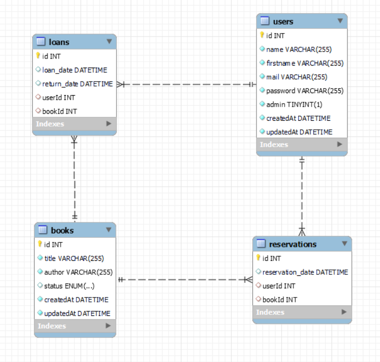

# Librarie

## Table of Contents

- [Librarie](#librarie)
  - [Table of Contents](#table-of-contents)
  - [Installation](#installation)
    - [Frontend Local](#frontend-local)
    - [Backend Local](#backend-local)
  - [Fonctionnalités](#fonctionnalités)
  - [Technologies](#technologies)
    - [Frontend](#frontend)
    - [Backend](#backend)
    - [BDD](#bdd)
  - [Variables d'environnement](#variables-denvironnement)
    - [Frontend](#frontend-1)
    - [Backend](#backend-1)
  - [Scripts](#scripts)
    - [Frontend](#frontend-2)
    - [Backend](#backend-2)

## Installation

### Frontend Local
Dans un terminal :
- `cd library-app`
- `npm i`
- `npm run start`

### Backend Local
Dans un terminal :
- `cd back`
- `npm i`
- `npm run start`

## Fonctionnalités

- **Authentification des utilisateurs** : Connexion et inscription pour les utilisateurs.
- **Gestion des livres** : Voir une liste de livres disponibles et empruntés.
- **Système de prêts** : Les utilisateurs peuvent emprunter ou réserver des livres. 
- **Mise à jour dynamique du statut** : Le système met à jour le statut des livres de manière dynamique après un emprunt ou une réservation.
- **Gestion des administrateurs** : L'administrateur peut gérer les livres, les utilisateurs, les enregistrements de prêts, les retours.

## Technologies

### Frontend
- **React**
- **Bootstrap**
- **Axios**
- **JWT-Decode**

### Backend
- **Node.js**
- **Express.js** 
- **Sequelize ORM** : ORM pour gérer la base de données MySQL
- **JWT** : Utilisé pour l'authentification sécurisée
  
### BDD
Base de données MySQL, veuillez créer la base de données `library_management`

## Variables d'environnement

### Frontend
- **REACT_APP_API_URL** : L'URL de l'API pour le frontend

### Backend
- **DB_NAME** : Nom de la base de données
- **DB_USER** : Utilisateur de la base de données
- **DB_PASSWORD** : Mot de passe de la base de données
- **DB_HOST** : Hôte de la base de données
- **PORT** : Port du serveur backend
- **JWT_SECRET** : Code secret utilisé pour la signature des tokens JWT

## Scripts

### Frontend
- `npm run start` : Lancer l'application en mode développement.
- `npm run test` : Lancer les tests (Tests non encore implémentés).

### Backend
- `npm run start` : Lancer le serveur backend en local.
- `npm run test` : Lancer les tests backend.
